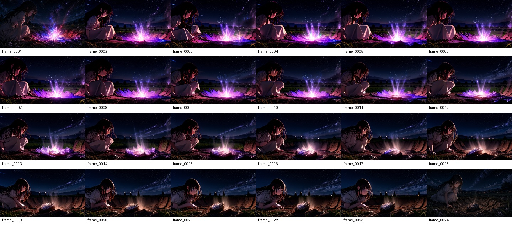
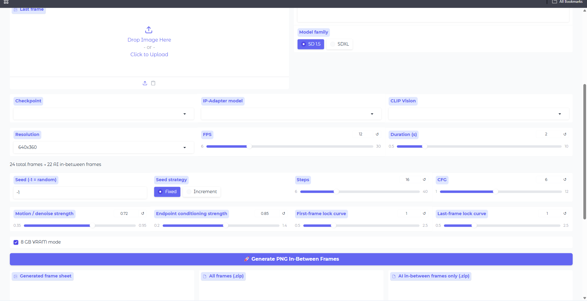

# Frame_Generator_V1

<p align="center">
  <b>Local AI frame-by-frame image generation from a first frame, last frame, and action prompt.</b><br>
  Powered by ComfyUI • Designed around individual PNG frame generation
</p>

<p align="center">
  <a href="https://github.com/Zeron-62/Frame_Generator_V1/stargazers">
    
  </a>
  <a href="https://github.com/Zeron-62/Frame_Generator_V1/blob/main/LICENSE">
    
  </a>
  
  
  
</p>



## ✨ What it does

Frame_Generator_V1 takes:

- 🖼️ a **First Frame**
- 🖼️ a **Last Frame**
- ✍️ an **Action / Motion Prompt**

and generates the images between those two endpoints as **individual PNG frames**.

```text
                  ┌──────────────────────────────┐
First Frame ─────►│                              │
                  │   Frame_Generator_V1         ├──► PNG sequence
Action Prompt ───►│   local AI generation        │
                  │                              │
Last Frame ──────►│                              │
                  └──────────────────────────────┘
```

> **This is an image generator, not a direct video generator.**
> The core output is a sequence of images. The first and last images are preserved as the endpoints and the middle images are generated individually.

---

## 🖥️ Interface

The application exposes controls for the endpoint images, model selection, resolution, FPS, duration, seed, diffusion settings, endpoint conditioning, consistency and 8 GB VRAM mode.



---

## 🌟 Features

| Feature | What it does |
|---|---|
| 🖼️ First + Last Frame | Uses two endpoint images as visual references |
| ✍️ Action Prompt | Describes the movement or pose change |
| 🤖 AI In-Between Frames | Generates individual middle images with diffusion |
| 🎛️ Seed / Steps / CFG | Fine-tune the diffusion generation |
| 📐 Resolution | Control output image size |
| 🎞️ FPS + Duration | Calculate the required frame count |
| 🔗 IP-Adapter | Condition the generation on endpoint images |
| 🧩 ComfyUI API | Uses a local ComfyUI backend |
| 🖥️ 8 GB VRAM Mode | Conservative profile for lower-VRAM NVIDIA GPUs |
| 🔍 Preview Frames | Test selected transition positions before full generation |
| 📦 PNG Export | Export all frames or only the AI-generated in-betweens |
| 📝 Metadata | Record generation settings for reproducibility |

---

## ⚡ Quick Start

### 1. Start ComfyUI

Run **ComfyUI Desktop** and make sure its local API is available:

```text
http://127.0.0.1:8188
```

### 2. Install the IP-Adapter node

In ComfyUI Manager / Extensions, install:

```text
ComfyUI_IPAdapter_plus
```

Restart ComfyUI afterward.

### 3. Install the required model files

Frame_Generator_V1 does **not** distribute model weights.

Install the required checkpoint, IP-Adapter and CLIP Vision files in the model locations used by your ComfyUI installation.

See [`docs/MODELS.md`](docs/MODELS.md).

### 4. Start Frame_Generator_V1

From the repository folder:

```bat
install.bat
run.bat
```

The web UI opens at:

```text
http://127.0.0.1:7860
```

### 5. Connect the applications

In Frame_Generator_V1 → **Setup**, keep:

```text
http://127.0.0.1:8188
```

Click:

```text
Save & Test Connection
Refresh model lists
```

### 6. Generate a sequence

Upload the first frame and last frame, enter an action prompt, choose the models and generation settings, then generate the PNG sequence.

---

## 🎬 Example

Example prompt:

```text
The girl slowly turns her head from left to right,
her hair gently moving in the wind,
natural pose progression,
consistent character, clothing, camera, and background.
```

For:

```text
12 FPS × 2 seconds
```

the application targets:

```text
24 total frames
22 AI-generated in-between frames
2 original endpoint frames
```

---

## 🎛️ Recommended 8 GB VRAM Profile

The initial profile is intended for an NVIDIA GPU around 8 GB VRAM with 32 GB system RAM.

| Setting | Starting value |
|---|---:|
| Model family | SD 1.5 |
| Resolution | 640×360 |
| FPS | 12 |
| Duration | 2 s |
| Steps | 16 |
| CFG | 6 |
| Endpoint denoise | 0.36 |
| Middle denoise | 0.68 |
| Endpoint conditioning | 1.00 |
| Previous-frame consistency | 0.16 |
| Previous-frame guide anchor | 0.10 |
| Transition curve | Smoothstep |
| 8 GB VRAM mode | Enabled |

> Each in-between frame is a separate image-generation job. More frames, higher resolutions and more diffusion steps increase runtime and memory usage.

---

## 🧠 Current Conditioning Approach

The current prototype can combine:

- weighted first-frame and last-frame IP-Adapter embeddings
- an adaptive denoise schedule that is lower near the endpoints and higher toward the middle
- a hidden endpoint guide used only as an img2img starting point
- an optional low-weight previous-frame reference for temporal continuity
- configurable transition curves

The hidden guide is **not exported as a frame**.

**No frame interpolation or cross-fade is used as the final output.**

---

## 📦 Output

A completed job can produce:

```text
output/
├── FrameForge_<job>_contact_sheet.jpg
├── FrameForge_<job>_all_frames.zip
├── FrameForge_<job>_inbetween_only.zip
├── FrameForge_<job>_metadata.json
└── frames/<job>/
    ├── frame_0001.png
    ├── frame_0002.png
    ├── ...
    └── frame_0024.png
```

Generated outputs, logs, temporary inputs, virtual environments and Python caches should remain untracked.

---

## 🧰 Requirements

- Windows
- NVIDIA GPU
- 8 GB VRAM recommended minimum for the included SD 1.5 profile
- 32 GB system RAM recommended
- ComfyUI Desktop or a local ComfyUI server
- Python dependencies listed in `requirements.txt`

---

## 📚 Documentation

- [`docs/MODELS.md`](docs/MODELS.md) — model files and setup
- [`CONTRIBUTING.md`](CONTRIBUTING.md) — contribution guidelines
- [`SECURITY.md`](SECURITY.md) — security reporting
- [`THIRD_PARTY_NOTICES.md`](THIRD_PARTY_NOTICES.md) — third-party software and model notices
- [`CHANGELOG.md`](CHANGELOG.md) — project history

---

## 🗺️ Roadmap

Planned refinement areas include:

- stronger character and background consistency
- improved motion distribution across the full sequence
- more controllable temporal conditioning
- better handling of hands, hair and small moving details
- additional model profiles
- improved preview and debugging tools
- simpler workflow and model setup

---

## 🤝 Contributing

Experiments, bug reports, workflow improvements and pull requests are welcome.

Please read [`CONTRIBUTING.md`](CONTRIBUTING.md) before contributing.

---

## ⚠️ Project Status

**Experimental / active development**

Generation quality can vary with the checkpoint, prompt, source artwork and conditioning settings. The project is focused on local, image-by-image generation rather than direct video generation.

---

## 📄 License

The Frame_Generator_V1 project code is released under the **MIT License**.

See [`LICENSE`](LICENSE).

Third-party software, node packages and model weights remain under their own licenses and terms. See [`THIRD_PARTY_NOTICES.md`](THIRD_PARTY_NOTICES.md).

---

## ⭐ Project Goal

> **Use AI to create the images between two keyframes — one frame at a time.**
